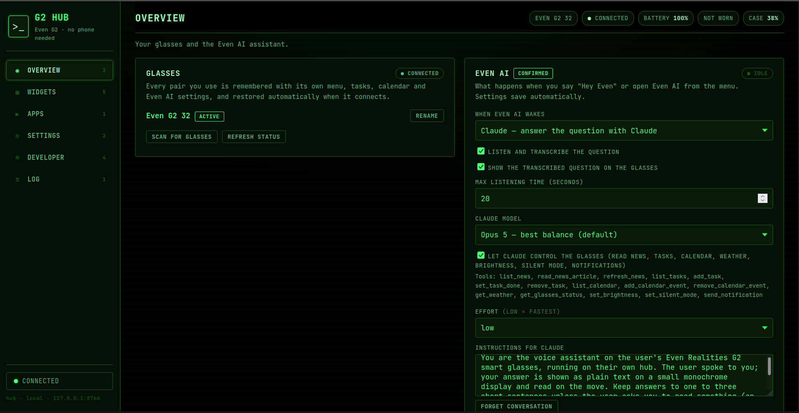

# open-g2-hub

A standalone, completely offline replacement system for the Even Realities G2 smart glasses companion app. It runs on unmodified stock firmware and provides full control over the native dashboard widgets and the AI microphone stream.

## Why This Instead of MentraOS?
Unlike MentraOS—which runs a custom ecosystem of third-party applications—**open-g2-hub** communicates directly with the factory layouts built into the glasses. It replaces the official smartphone app entirely, keeping your data local, offline, and free from vendor cloud dependencies.

## Features & Capabilities

*   **Offline Hub Connection:** Standalone local network management dashboard running on local hosts without vendor cloud dependencies.
*   **Complete Widget Orchestration:** Full read, write, and injection capabilities across all native firmware widgets including News, Tasks, and Calendar.
*   **Custom AI Routing Engine:** Intercepts native "Hey Even" voice triggers or manual touch inputs and proxies the raw audio stream to custom LLMs (e.g., Anthropic Claude).
*   **Advanced Assistant Guardrails:** Supports deep system instruction injection, transcription toggle views, customizable listening timeouts, and local tool execution calling (brightness tweaks, status reads, silent mode toggles, and notification routing).
*   **Multi-Device Synchronization:** Automatically caches and restores individualized configurations, layouts, and assistant presets across different glasses pairs upon BLE reconnect.
  
## Protocol Breakdown

### 1. Transport & Characteristics
The glasses consist of two independent BLE peripherals (Left and Right lens). Both must be bonded at the OS level. The system communicates via base UUID `00002760-08c2-11e1-9073-0e8ac72e____` using three primary suffixes:

*   **`5401` (Write):** Control frames for commands, widget updates, and configuration.
*   **`5402` (Notify):** Device events and command replies.
*   **`6402` (Notify):** Raw microphone audio data. Subscribing to this channel on the Left lens captures the un-headered LC3 audio streams during voice tasks.

### 2. Wire Frame Format
Control messages sent over characteristic `5401` must follow this exact byte alignment:

```text
AA  21  seq  len  total  num  SID  flag  payload...  crc_lo crc_hi
```

*   **`AA`**: Packet head identifier.
*   **`21`**: Routing byte (Phone to Glasses). Replies from the glasses use `12`.
*   **`seq`**: Sync ID byte, randomized per transmission block.
*   **`len`**: Payload segment length (includes the 2 trailing CRC bytes if it is the final packet).
*   **`total`**: Total number of packets in the message (1-based).
*   **`num`**: Current packet sequence number (1 to total).
*   **`SID`**: Service ID determining the destination feature block.
*   **`flag`**: Control flag byte. Set to `0x20` (`FLAG_REQUEST`) for control commands.
*   **`crc_lo / crc_hi`**: Little-endian CRC-16/CCITT-FALSE checksum (polynomial `0x1021`, initial value `0xFFFF`) calculated strictly over the payload.

### 3. Core Service IDs (SIDs) & Logic

*   **Session Initialization (SID `0x80`):** Pushes device configuration arrays (`08 04 10 <magic> 1a 04 08 01 10 04`) to both lenses to establish trusted data routing.
*   **Prelude (SID `0x01`):** Sends cmd 2 (`Dashboard_Receive`) with an empty body using a fixed magic number (156) to the Right lens to initialize layout mapping.
*   **EvenHub Heartbeat (SID `0xE0`):** Requires cmd 12 to be sent to the Right lens every ~4 seconds as a fire-and-forget message. Halting this loop causes the glasses to trigger a connection-lost error.
*   **Widget Text Injection:** Pushing manually packed Google Protobuf data through SID `0x01` routes text changes directly into the native layout structures of the built-in widgets (News feed, Tasks, and Calendar).

## Media & Interface Showcase

Below are images and animations showing the standalone hub running interface synchronization, custom widget data updates, and native AI microphone captures.



---

## Work in Progress

This repo is being currently worked on and with the help of claude for reverse engineering the protocols.
Soon i will upload example python scripts and a full libary repo will be linked as well to control the device.
I know that a firmware update could wipe all progress so i have things in place to be able to deal with firmware updates.
If you find anything new or have ideas submit a request and ill take a look.

## 🛠️ Low-Level Bluetooth Protocol

The communication layer of this hub is powered by the **[even-g2-protocol](https://github.com/ithinkthisiscool/even-g2-protocol)** library. 

If you want to view the raw reverse-engineered Service ID (SID) mappings, inspect the custom dual-lens `GlassesSession` connection logic, or use the BLE communication framework independently without the full background gateway server and web interface, see the protocol driver repository.


## License
MIT License - see LICENSE file for details.
